# 16825: Learning For 3D Vision
## Project 4 Results - Vinayak Patel (vinayakp)

### 1. 3D Gaussian Splatting
### 1.1. 3D Gaussian Rasterization

    <figure style="display:inline-block; text-align:center; margin:10px;">
        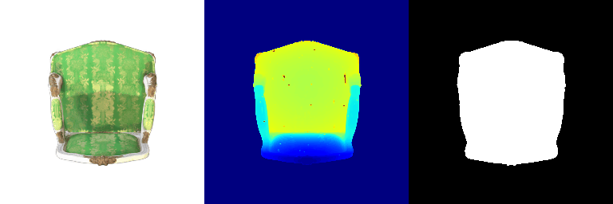
        <figcaption>Rendering</figcaption>
    </figure>

### 1.2. Training 3D Gaussian Representations
<table>
 <tr>
  <th>Parameter</th>
  <th>Value</th>
 </tr>
 <tr>
  <td>Learning Rate : Opacities</td>
  <td>0.03</td>
 </tr>
 <tr>
  <td>Learning Rate : Scales</td>
  <td>0.01</td>
 </tr>
 <tr>
  <td>Learning Rate : Colours</td>
  <td>0.025</td>
 </tr>
  <tr>
  <td>Learning Rate : Means</td>
  <td>0.005</td>
 </tr>
  <tr>
  <td>PSNR</td>
  <td>27.780</td>
 </tr>
  <tr>
  <td>SSIM</td>
  <td>0.921</td>
 </tr>
</table>

    <figure style="display:inline-block; text-align:center; margin:10px;">
        
        <figcaption>Final Rendering</figcaption>
    </figure>

    <figure style="display:inline-block; text-align:center; margin:10px;">
        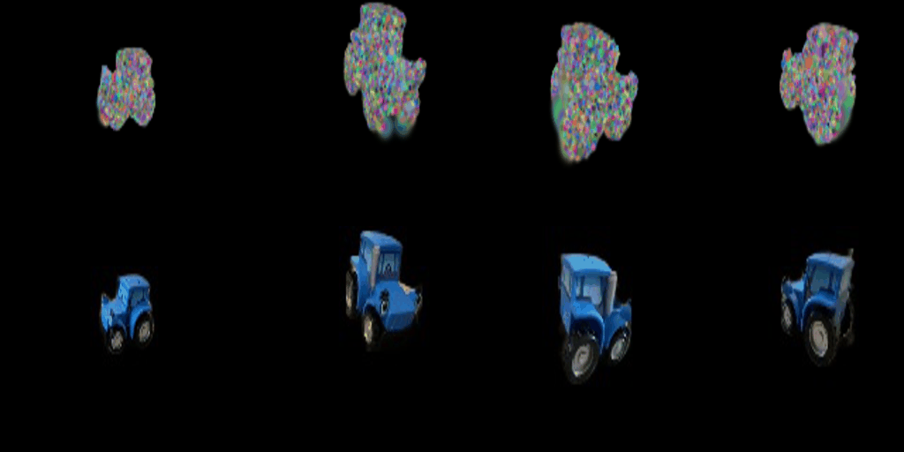
        <figcaption>Training In Progress</figcaption>
    </figure>

### 1.3. Extensions
### 1.3.1 Rendering Using Spherical Harmonics

    <figure style="display:inline-block; text-align:center; margin:10px;">
        
        <figcaption>No Spherical Harmonics</figcaption>
    </figure>

    <figure style="display:inline-block; text-align:center; margin:10px;">
        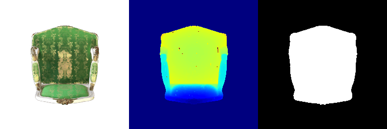
        <figcaption>With Spherical Harmonics</figcaption>
    </figure>

Views for Comparison
<table>
 <tr>
  <th>Frame Number</th>
  <th>Without Spherical Harmonics</th>
  <th>With Spherical Harmonics</th>
 </tr>
 <tr>
  <td>000</td>
  <td>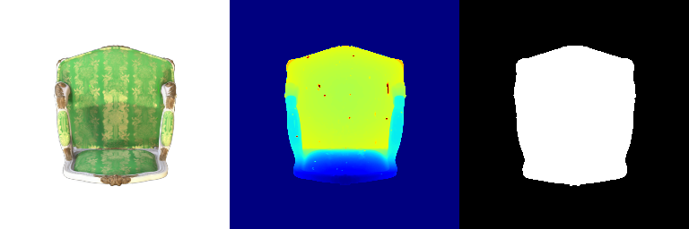</td>
  <td>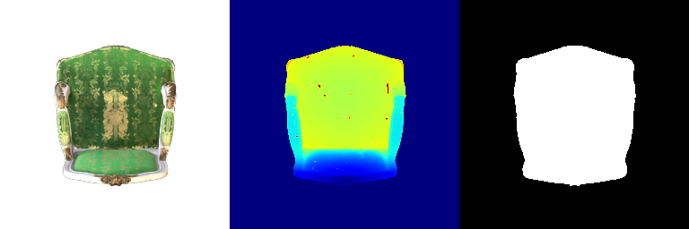</td>
 </tr>
 <tr>
  <td>013</td>
  <td>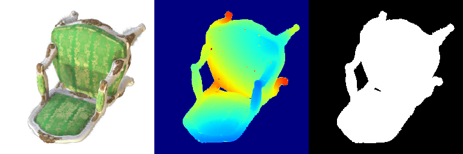</td>
  <td></td>
 </tr>
 <tr>
  <td>027</td>
  <td></td>
  <td>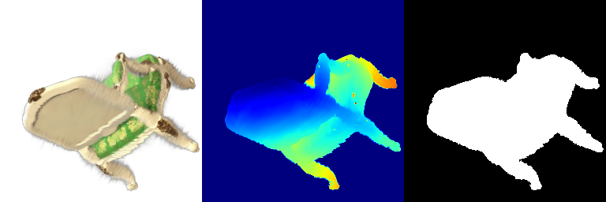</td>
 </tr>
</table>

<b>Differences:</b> 
1. The reflections in the rendering with spherical harmonics are much more pronounced and realistic than compared to the regular rendering case without spherical harmonics. 
2. The rendering appears more realistic, with the lighting and shading information supplemented by the spherical harmonics. 
3. Even the colors are are more popping in the scene with spherical harmonics. It feels as if we turned on HDR and RTX On in a game such as Doom Eternal.

### 2. Diffusion-guided Opimization
### 2.1. SDS Loss + Image Optimization
Prompt: "a standing corgi dog"

    <figure style="display:inline-block; text-align:center; margin:10px;">
        
        <figcaption>Without Guidance : 1500 iterations</figcaption>
    </figure>
    <figure style="display:inline-block; text-align:center; margin:10px;">
        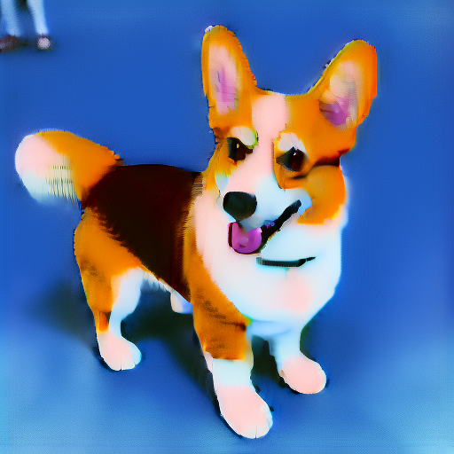
        <figcaption>With Guidance : 2000 iterations</figcaption>
    </figure>

Prompt: "a hamburger"

    <figure style="display:inline-block; text-align:center; margin:10px;">
        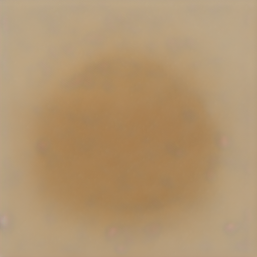
        <figcaption>Without Guidance : 400 iterations</figcaption>
    </figure>
    <figure style="display:inline-block; text-align:center; margin:10px;">
        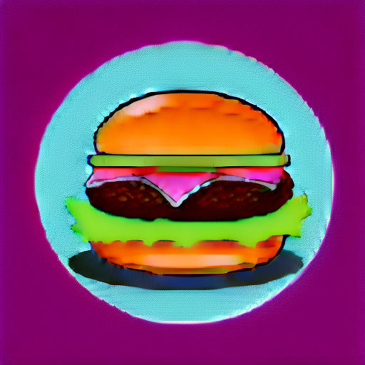
        <figcaption>With Guidance : 2000 iterations</figcaption>
    </figure>

Prompt: "the Forlorn from Dark Souls II Scholar of the First Sin"

    <figure style="display:inline-block; text-align:center; margin:10px;">
        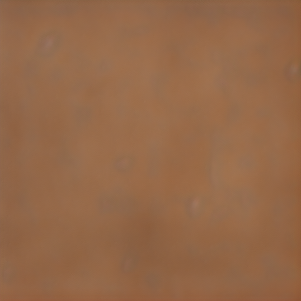
        <figcaption>Without Guidance : 600 iterations</figcaption>
    </figure>
    <figure style="display:inline-block; text-align:center; margin:10px;">
        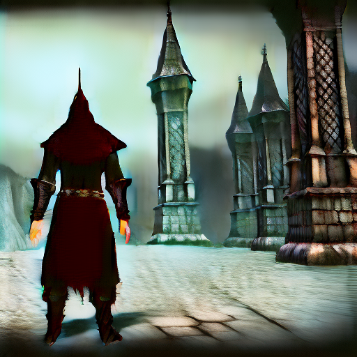
        <figcaption>With Guidance : 2000 iterations</figcaption>
    </figure>

Promt: "a photo of Tom Cruise winking"

    <figure style="display:inline-block; text-align:center; margin:10px;">
        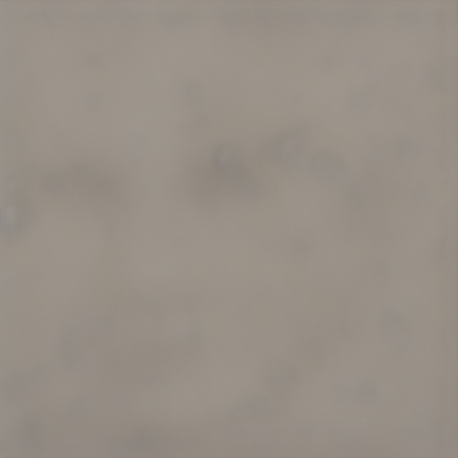
        <figcaption>Without Guidance : 600 iterations</figcaption>
    </figure>
    <figure style="display:inline-block; text-align:center; margin:10px;">
        
        <figcaption>With Guidance : 2000 iterations</figcaption>
    </figure>

### 2.2. Texture Map Optimization for Mesh

 
    <figure style="display:inline-block; text-align:center; margin:10px;">
        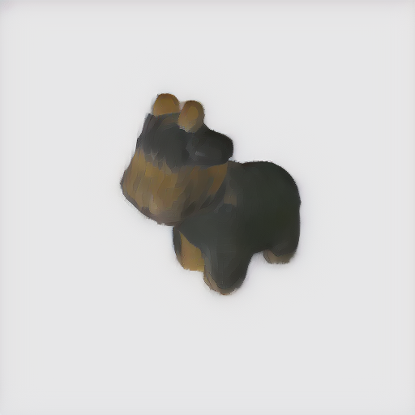
        <figcaption>Prompt: "brown cow with green spots" 600 iterations</figcaption>
    </figure>
    <figure style="display:inline-block; text-align:center; margin:10px;">
        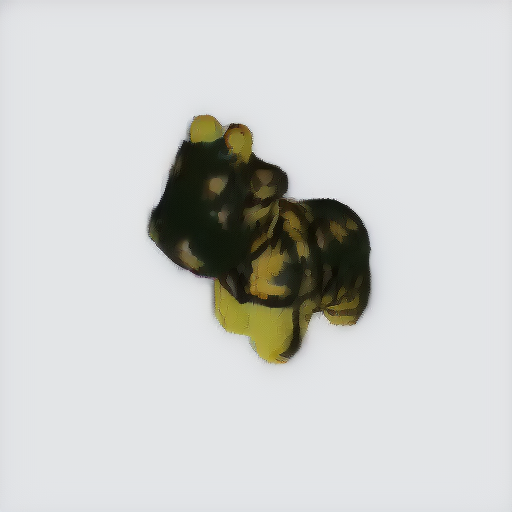
        <figcaption>   Prompt: "cow with cheetah pattern having black and yellow color" 600 iterations</figcaption>
    </figure>

### 2.3. NeRF Optimization
<table>
 <tr>
  <th>Parameter</th>
  <th>Value</th>
 </tr>
 <tr>
  <td>lambda_entropy</td>
  <td>0.00001</td>
 </tr>
 <tr>
  <td>lambda_iter_ratio</td>
  <td>0.001</td>
 </tr>
 <tr>
  <td>lambda_orient</td>
  <td>0.001</td>
 </tr>
  <tr>
  <td>Iterations</td>
  <td>5000</td>
 </tr>
</table>

I tried a few prompts but I was not able to get good results for this part. I was always getting white noise at the end.

### 2.4. Extensions
### 2.4.1. View-dependent texture embedding
<video width="256" height="256" controls>
  <source src="website_results/videos/depth_ep_40.mp4" type="video/mp4">
</video> 
<video width="256" height="256" controls>
  <source src="website_results/videos/rgb_ep_40.mp4" type="video/mp4">
</video>

https://github.com/user-attachments/assets/f76ba9c3-c45e-4439-a312-577b774a0f8a

https://github.com/user-attachments/assets/3b90b733-1141-49ff-bada-8eaa70e38cd3

After 40 epochs. Top one is depth. Bottom one is RGB

